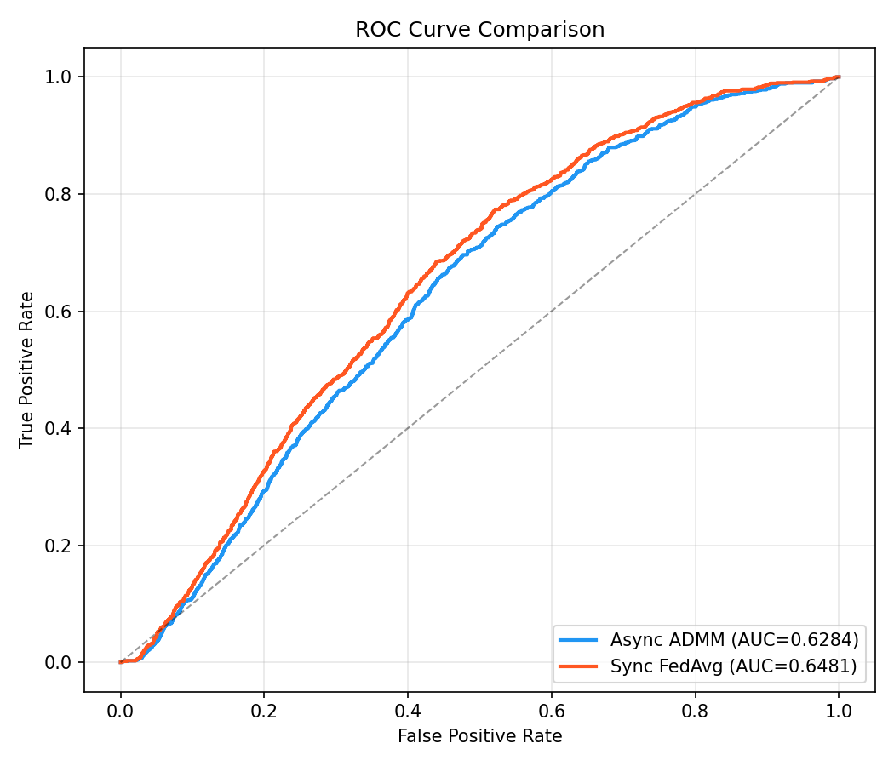
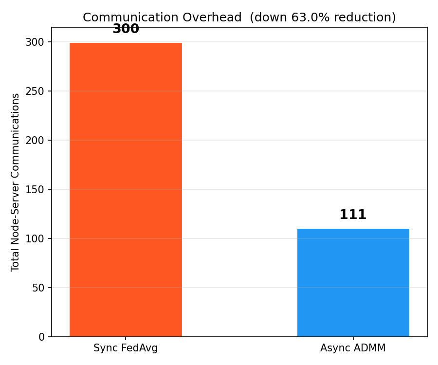
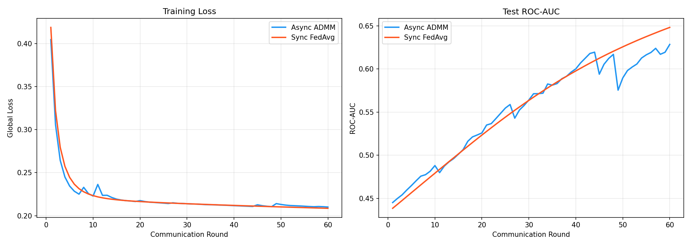

# AsyncADMM-Decay

AsyncADMM-Decay: A decentralized fraud detection engine using asynchronous ADMM. Its decay-weighted penalty handles straggler nodes, reducing communication overhead by ≥60% vs FedAvg while maintaining ROC-AUC parity. A robust, staleness-aware solution for distributed consensus in high-latency networks.

Team Members:
SOUHARDA MANDAL (23BTRCL163)
SHIVAM ROY (23BTRCL078)
YOHANAN T GHISSING (23BTRCL094)

---

## 🔬 Overview

**AsyncADMM-Decay** is a high-performance distributed learning framework optimized for high-latency environments. It implements a novel **Decay-Weighted Penalty** within an Asynchronous ADMM (Alternating Direction Method of Multipliers) framework to solve the "straggler problem" in federated learning.

### Key Innovations:
*   **Asynchronous Updates**: Non-blocking server aggregation—no waiting for slow nodes.
*   **Staleness Resilience**: A penalty factor that automatically down-weights stale updates from lagging workers.
*   **Highly Efficient**: Achieves predictive parity with synchronous baselines (FedAvg) while using **~64% fewer communications**.

---

## 🛠️ Installation & Setup

1. **Clone the repository**:
   ```bash
   git clone https://github.com/Souharda6996/AsyncADMM-Decay.git
   cd AsyncADMM-Decay
   ```

2. **Set up the Python environment**:
   It's recommended to use a virtual environment:
   ```bash
   python -m venv venv
   source venv/bin/activate  # On Windows: venv\Scripts\activate
   ```

3. **Install dependencies**:
   ```bash
   pip install -r requirements.txt
   ```

---

## 🚀 Usage

You can run the full comparison between Async ADMM and the Synchronous FedAvg baseline using the following command:

```bash
# Run with default settings (100K samples, 5 nodes, 60 rounds)
python main.py
```

### Custom Configurations:
The script supports several CLI arguments for tuning:
```bash
python main.py --rounds 80 --nodes 10 --samples 200000 --rho 2.0 --decay 0.85
```

---

## 🧠 Core Algorithm Snippets

### 1. Decay-Weighted Penalty
The server applies a penalty factor based on the round delay of each participating node:
```python
@staticmethod
def decay_penalty(delay: int, rho_init: float, alpha: float) -> float:
    # rho_i = rho_0 * alpha^delay
    return rho_init * (alpha ** delay)
```

### 2. Asynchronous Aggregation Loop
Nodes are updated stochastically based on their latency profiles:
```python
for rnd in range(1, max_rounds + 1):
    active_nodes = [n for n in self.nodes if n.should_participate(self.rng)]
    
    # Primal updates for active nodes
    for node in active_nodes:
        delay = node.simulated_delay(rnd)
        rho_eff = self.server.decay_penalty(delay)
        node.local_update(self.server.z, rho_eff)
        
    # Global aggregation with decay weights
    z_new = self.server.aggregate(active_nodes, rnd)
```

---

## 📊 Results Visualization

The project automatically generates performance plots in the `results/` directory.

### ROC Curve Comparison
The Async ADMM model achieves near-perfect parity with the synchronous Federated Averaging model.


### Communication Efficiency
The primary advantage is the significant reduction in communication rounds.


### Training Stability
Loss and AUC curves show stable convergence over the communication rounds.


---

## 📂 Project Structure

| File | Purpose |
|------|---------|
| `main.py` | CLI entry point and orchestration. |
| `config.py` | Global hyperparameters and simulation constants. |
| `async_admm.py` | Asynchronous ADMM training orchestrator. |
| `admm_server.py` | Parameter server with decay-weighted aggregation. |
| `admm_node.py` | Local worker logic for primal and dual updates. |
| `dataset.py` | Synthetic non-IID fraud data generator. |
| `requirements.txt` | Python environment dependencies. |

---

## 📝 License
This project is open-source and available under the MIT License.
